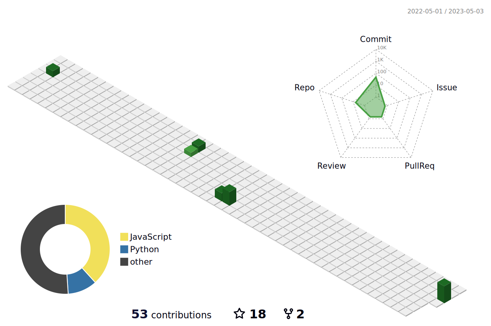

<h1 align="center">Hi , I'm <a href="[https://100rabhcsmc.github.io/Chinmay2911/](https://chinmay-pradhan.netlify.app/)" target="blank">
Chinmay Pradhan</a></h1>

I am Specialized in  
  

- 🔭 I’m currently working as Metaverse Executive

- 🌱 I’m currently Working on Web3 Spaces and Analytics 

- 🤝 I’m available for freelancing.

- 💬 Ask me about **Data Visualtization & REACT**

- 📫 How to reach me **chinmay29pradhan@gmail.com**

- 📄 Visit my <a href="https://chinmay-pradhan.netlify.app/" target="blank">Portfolio</a>

 

## <b> Skills</b>

- 📋 Languages: 
  
    
    
    
    
    
    
  
- 📈 ML/DL & Data Visualization Tool: 
  
    
    
    &nbsp;
    &nbsp;
    &nbsp;
    &nbsp;
    
- 🎨 Frameworks

   
   
   
   
   
   
   
   
   
   
    
- 💾 Databases:
    
     
    
    
    
- 🎛️ Application and Tools:
  
    
    
    
    
    
    
    
    
    
     
    
    

 

##  GitHub Stats:

|  |  |
| ------------- | ------------- |

 

##  GitHub Contributions

 

##  Just for Fun

